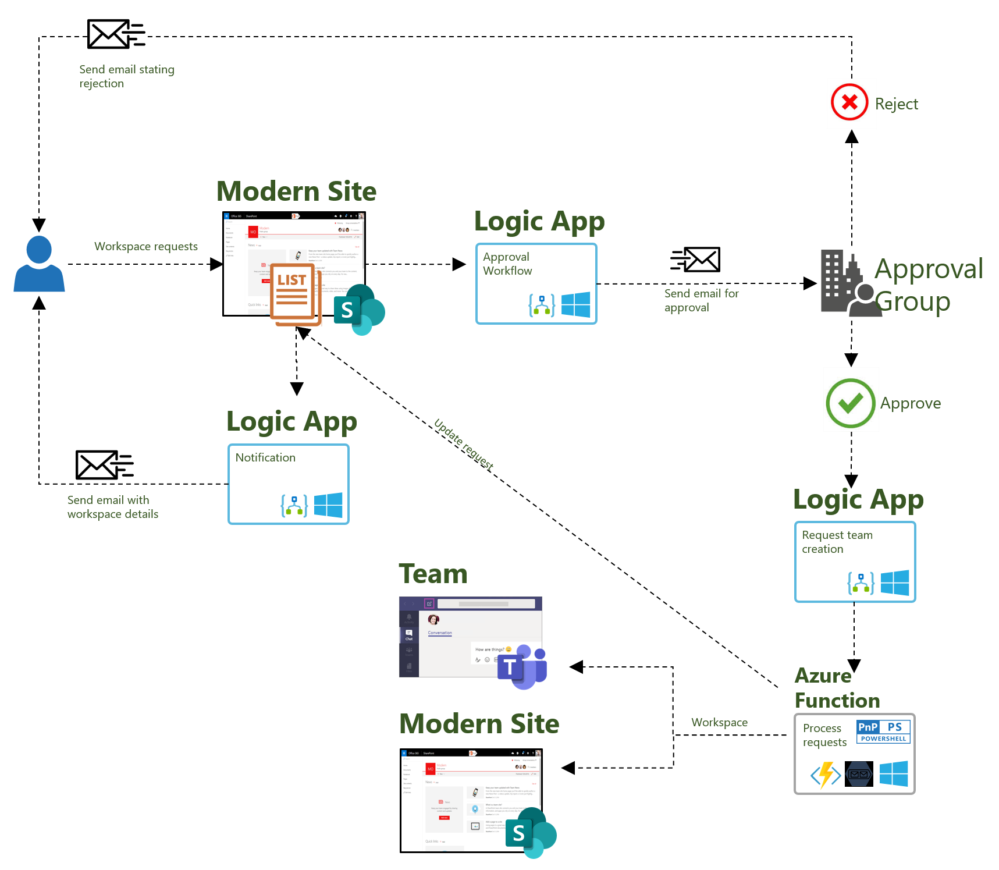
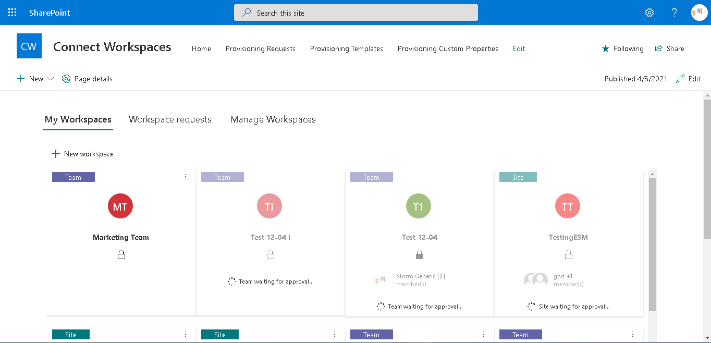
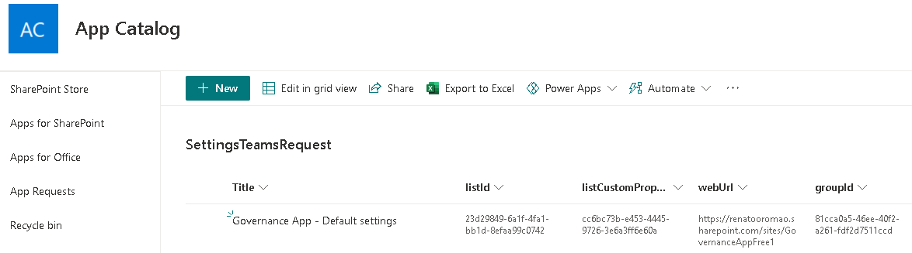
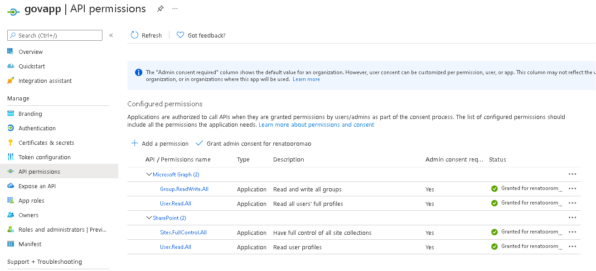
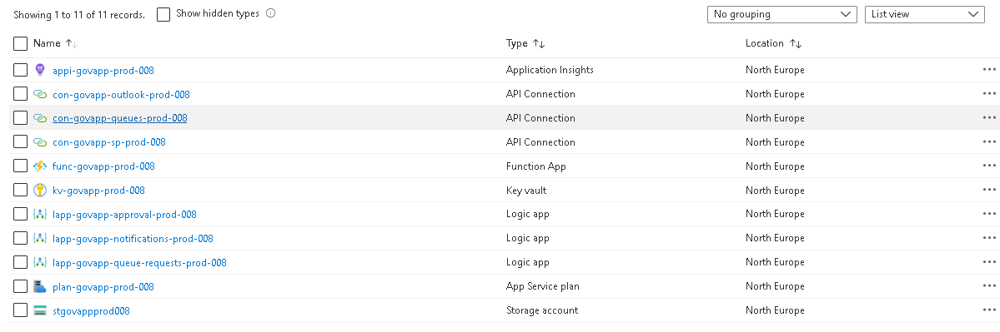

<br/>


<br/>
<br/>

# Storm's Microsoft 365 Governance App

<br/>

## Introduction

This repository contains all the deployment resources required for the Storm's Governance app:

- Deployment script for deploying via PowerShell:
  - Azure AD app
  - SharePoint resources
  - Azure Function and related resources
  - Azure Logic Apps and connections

<br/>

## High-level solution diagram



<br/>

## Pre-requisites

In order to successfully run the PowerShell script for deployment, you need:

- Active Microsoft 365 tenant
- Access to an Azure Subscription
- The recommended account permissions level is Global Admin (Office 365 and Azure)
- SharePoint Tenant App Catalog created - if you just created it, wait a few minutes to ensure that process is complete
- Office 365 Service account that will run all the Emails and connections
- Install PowerShell core - https://docs.microsoft.com/en-us/powershell/scripting/install/installing-powershell-core-on-windows?view=powershell-7.1
- Install Azure CLI Following the steps here - https://docs.microsoft.com/en-us/cli/azure/install-azure-cli?view=azure-cli-latest

<br/>

## Deploy the solution

### Edit script parameters

Before executing the deployment scripts for SharePoint and Azure resources, you need to edit them and provide information regarding your Microsoft 365 tenant and Azure subscription.

Edit `deploy-sharepoint.ps1` at the root folder of the solution

``` PowerShell
.\sharepoint\deploy-shp.ps1 `
    -TenantName "contoso" ` # Microsoft 365 tenant name
    -ServiceAccountUPN "admin@contoso.onmicrosoft.com" ` # service account for SharePoint site
    -ApprovalTeamId "xxxxxxxx-xxxx-xxxx-xxxx-xxxxxxxxxxxx" ` # Id of the Teams team for administrators of the app. You should create a new Team if one does not currently exist 
    -ManagedPath "sites" ` # managed path of the SharePoint site. Common options: sites, teams
    -SPOUsername "admin@contoso.onmicrosoft.com" ` # username of account for deployment
    -SPOPassword 'admin_password' # password of account for deployment
```

Edit `deploy-azure.ps1` at the root folder of the solution

``` PowerShell
.\azure\deploy-az.ps1 `
    -TenantName "contoso" ` # Microsoft 365 tenant name
    -TenantId "xxxxxxxx-xxxx-xxxx-xxxx-xxxxxxxxxxxx" ` # Azure tenant Id - can be found under Azure Active Directory of the tenant where azure resources will be deployed
    -SubscriptionId "xxxxxxxx-xxxx-xxxx-xxxx-xxxxxxxxxxxx" ` # Id of the Azure subscription where resources will be deployed
    -SPOTenantId "xxxxxxxx-xxxx-xxxx-xxxx-xxxxxxxxxxxx" ` # Azure tenant Id - can be found under Azure Active Directory associated with the Microsoft 365 tenant
    -SPOUsername "admin@contoso.onmicrosoft.com" ` # username of the SharePoint service account
    -SPOPassword "admin_password" ` # password of the SharePoint service account
    -CertificatePassword 'XXXXXXXX' ` # password to be used by the certificate
    -Environment "prod" ` # environment type: possible values: dev, qa, uat, prod
    -InstanceNumber "001" ` # unique instance number for the deployment. Will be used when naming resources to ensure they are unique. Use a random number. If a number has been previously used, some resources will fail to deploy.
    -ApproverEmail "approver@contoso.onmicrosoft.com" ` # email account that will receive approval requests. Can be a user or Microsoft 365 group email
    -SiteAlias "GovernanceApp" ` # SharePoint site alias/url
    -ManagedPath "sites" ` # managed path of the SharePoint site. Common options: sites, teams
    -ResourceGroupName "rg-govapp-prod-001" ` # name of the Azure resource group that will contain the required resources. Will be created if not available yet
    -Location "northeurope" ` # Azure location for resource group and resources
    -AppName "GovApp" ` # name of the application. Will be used when generating names for resources
    -SiteTemplatesListUrl "ProvisioningTemplates" ` # Url of the SharePoint list where templates are stored
    -ProvisioningRequestsListUrl "Lists/ProvisioningRequests" # Url of the SharePoint list where requests are stored
```

### Run scripts

Open a PowerShell command prompt with Admin Rights.

- Windows PowerShell <br />
Execute `deploy-sharepoint.ps1` from the root folder of the solution. This will create a new SharePoint site with lists required for the solution and deploy a custom SPFx application. It will also create a configuration list within the App Catalog site.

- PowerShell Core <br />
Execute `deploy-azure.ps1` from the root folder of the solution. This will create a new Azure AD application registration and all the required azure resources.

<br/>

## Resources

Resources created by the deployment script

### SharePoint site

A new SharePoint site is created and contains the custom application where users will manage workspace requests.



### App Catalog configuration list

The script will create an additional list in the Tenant App Catalog site that is used as a central configuration location for the app. The configuration list should not be modified.



### Azure AD app registration

The Azure AD app registration created by the script will be used to [connect to SharePoint using app-only access](https://docs.microsoft.com/en-us/sharepoint/dev/solution-guidance/security-apponly-azuread). The app will have the following permissions


### Azure resources

The following Azure resources are deployed by the script and fully configured and ready to be used

